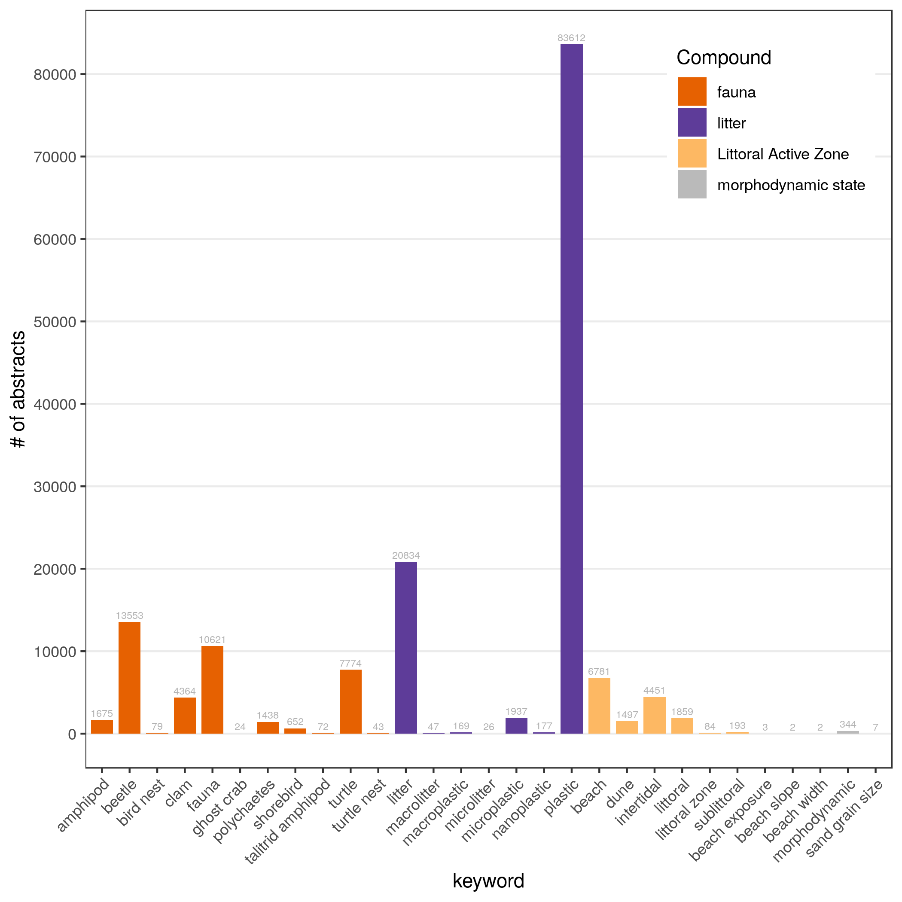
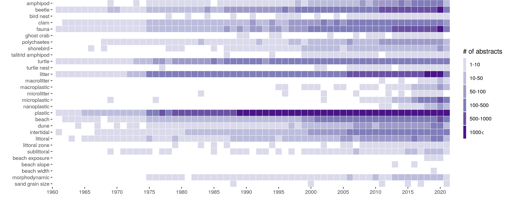
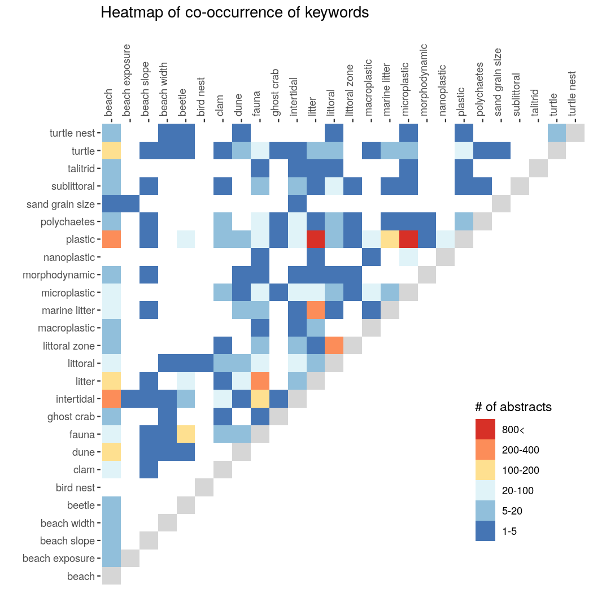
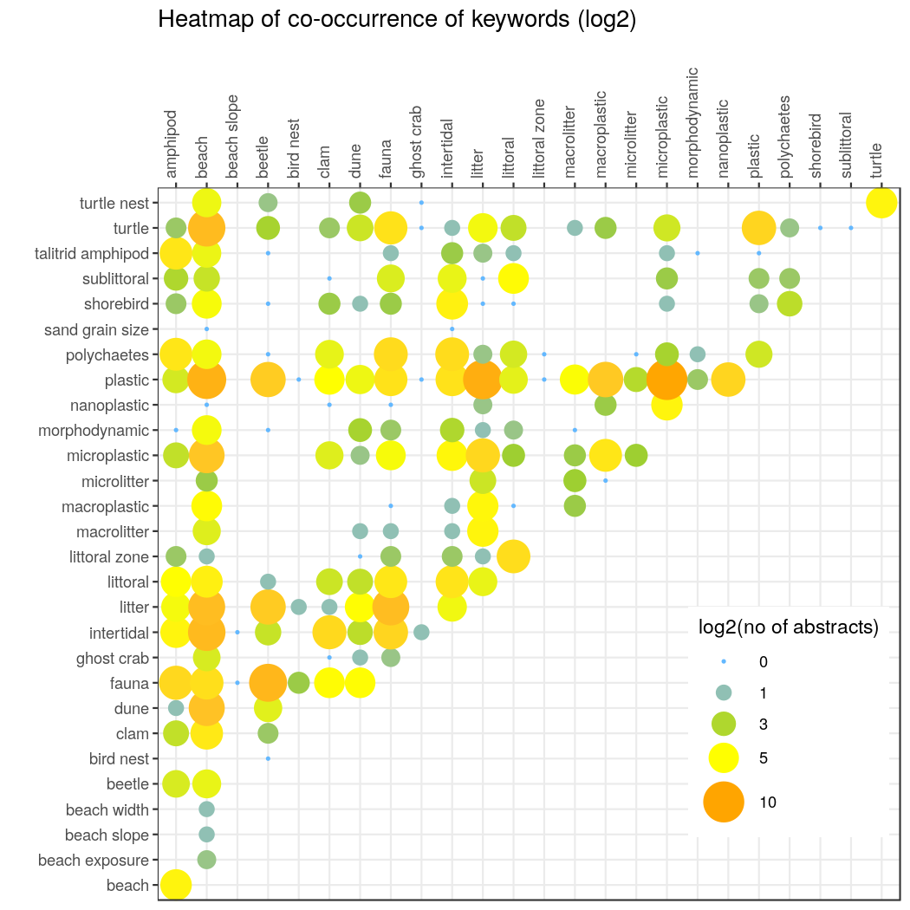
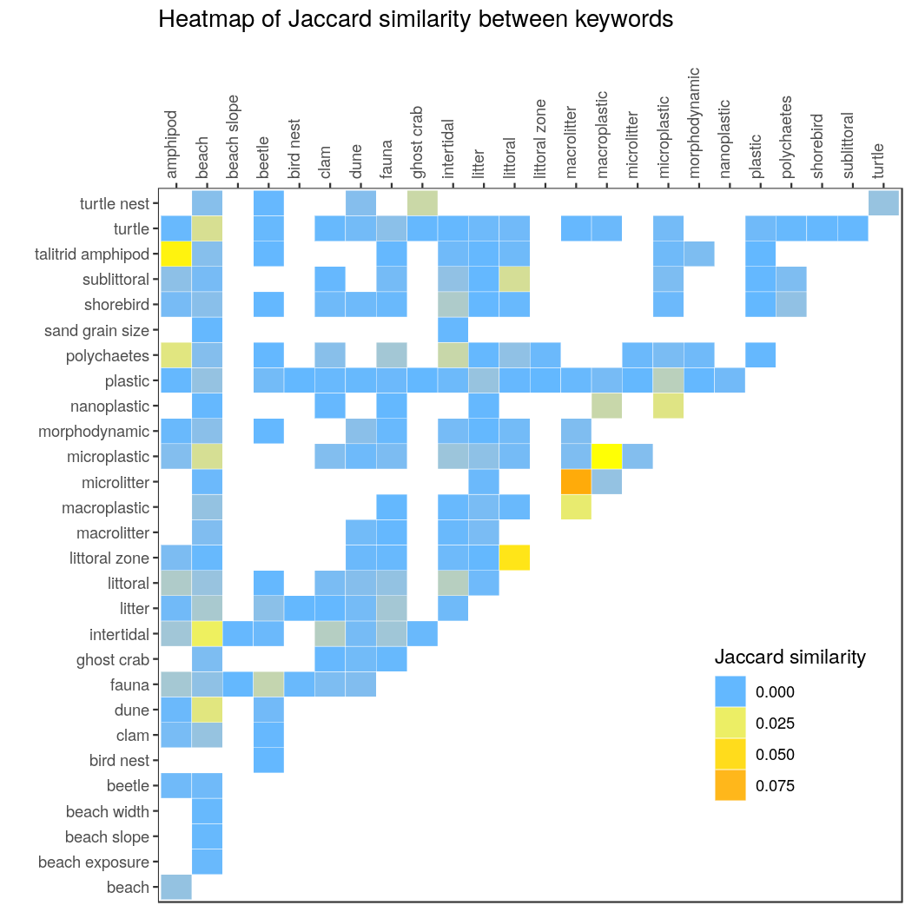
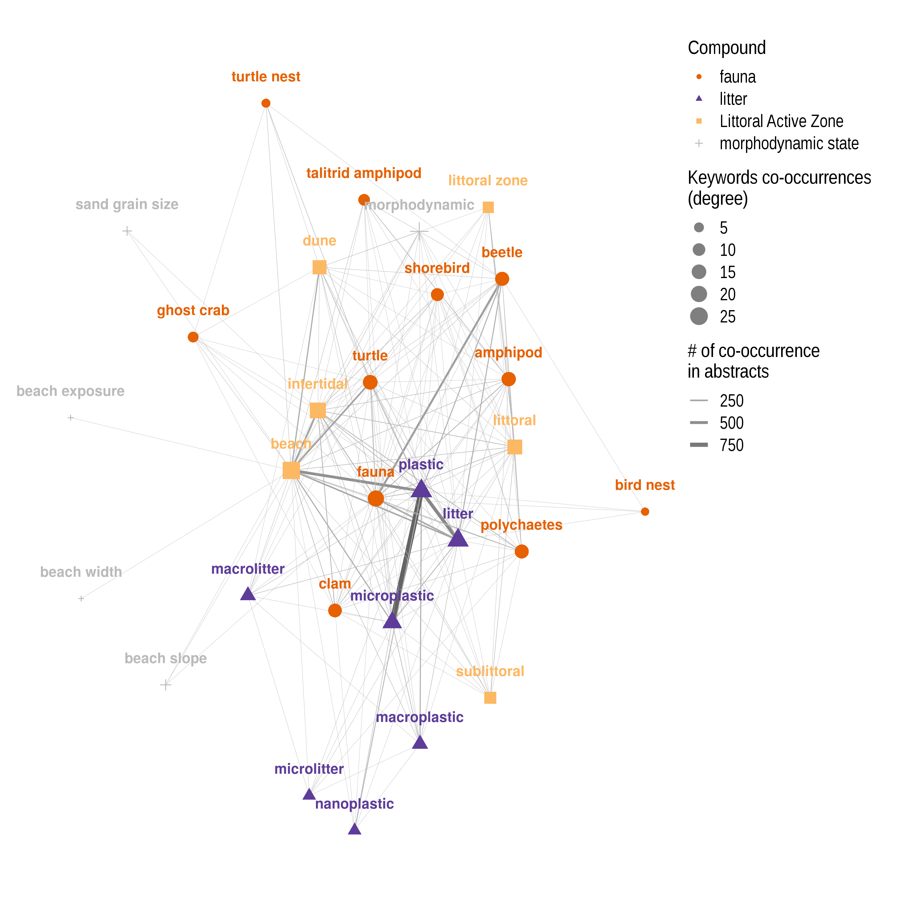

# DIG: trenD | Gap analysis of scientific literature


## Trend and Gap analysis of PubMed abstracts

This analysis aims to elucidate the trends of research focus and disciplines intersections. Trends will be found using specific keyword search in the PubMed corpus. When a keyword is found in an article the article ID (PMID) and year of publication are saved. Then we search the co-occurrences of keywords in the same article to infer when these keywords - research topics - started to combine.

## PubMed corpus

The data used for this analysis are the abstracts and article information of the PubMed database. PubMed corpus is freely available to download through * ftp * and the E-utilities API. For more information see [PubMed Download](https://www.nlm.nih.gov/databases/download/pubmed_medline_documentation.html).

The output of the ftp method are multiple xml files which then were transformed to tab separated files. All these files are zipped with the ``` gzip command```. Each .tsv.gz file contains 6 fields with the following structure:

 | PMID DOI |  Authors | Journal.volume:pages  | year  | title | Abstract  |
 | --- | --- | --- | --- | --- | --- |

## Keywords

A .txt file with the following keywords is read from the bash script. It has three columns

 |keyword synonyms | keyword | compound |

The first column has all the variable forms of the keyword of the second column.
The third column contains the general categories / compounds that the keywords belong to.

Here is an example:

```
amphipoda	amphipod	fauna
amphipods	amphipod	fauna
beach	beach	Littoral Active Zone
beach exposure	beach exposure	morphodynamic state
beach exposures	beach exposure	morphodynamic state
beach slope	beach slope	morphodynamic state
beach slopes	beach slope	morphodynamic state
beach width	beach width	morphodynamic state
beach widths	beach width	morphodynamic state
beaches	beach	Littoral Active Zone
beetle	beetle	fauna
beetles	beetle	fauna
bird nest	bird nest	fauna
bird nests	bird nest	fauna
clam	clam	fauna
clams	clam	fauna
donacid clams	clam	fauna
dune	dune	Littoral Active Zone
dunes	dune	Littoral Active Zone
fauna	fauna	fauna
ghost crab	ghost crab	fauna
ghost crabs	ghost crab	fauna
indicator fauna	indicator fauna	fauna
intertidal	intertidal	Littoral Active Zone
litter	litter	litter
littoral	littoral	Littoral Active Zone
littoral active zone	littoral active zone	Littoral Active Zone
littoral active zones	littoral active zone	Littoral Active Zone
littoral zone	littoral zone	Littoral Active Zone
littoral zones	littoral zone	Littoral Active Zone
```

## Prerequisites

In bash the the search is done in awk patterm ```match``` command and results are written in a file after being checked for duplicates and missing information.

For results file transformation, statistics and plotting we used R version 3.5.2 and the ``` tidyverse 1.3.0 ``` packages ``` readr, dplyr, ggplot2, tidyr```. For the network analysis the R packages ```Matrix```, ```igraph```,```tidygraph``` and ```gggraph``` are used.

## Running

The analysis is divided in two scripts, one shell script for keyword mining and one R script for data transformations and plotting. Plots are saved in ```.png``` format in a subdirectory named ``` plots ```.

The user is necessary to pass 3 arguments in the executable bash script. These arguments are passed through flags

* -k |  expects a the path of the txt file with the keywords
* -d |  expects the absolute path to the PubMed data
* -p |  expects a string with prefix of all the generated files (txt and plots)


```
./scripts/dig_analysis.sh -k keywords.txt -d ~/dig_analysis/dataset -p "ecology_trends"

```

When indexing is finished the script calls the r script to generate the plots.

### Search

The heart of the search is the ```match``` function after all abstracts and titles where transformed to lower letters.

### Plots

Three types of plots are created to provide insight to trends of the specific keywords.

#### Keywords frequency

In how many abstracts in PubMed each keyword is mentioned?



How many abstracts are published each year that contain each keyword?



#### Heatmap

Which keywords are mentioned in the same abstracts and in how many?

This question is awnsered with heatmaps, which illustrate the co-mention frequencies of all keyword pairs. Frequencies of mentions are symmetric so only the upper or lower triangle contain all information.

In order to find the co-mention frequencies we used a simple matrix multiplication. We start from an edgelist containing 2 columns, one with article ID's and one with keywords. We transform this edgelist to a n*m matrix and fill it with 0's and 1's whether a keyword is absent from an article or present, respectively. Then we multiplied this matrix with it's transposed matrix resulting in keyword co-mention frequencies. This method is also called one mode projection of a bipartite graph in graph theory.




Because the difference of keywords distance can be several orders of multitude we plotted the log2 values to reduce the divergence.




#### Jaccard similarity

We also wanted to quantify the co-mention of keywords in terms of similarity. We choose the Jaccard similarity because is intuitive and easy to calculate; it is defined as the intersection over the union of two sets. Hence it is located in the [0,1] space.



#### Random expectation 

In this heatmap we compare the co-mention frequency with random expectation.

All frequencies are measured with the total unique abstracts in PubMed.

## Network analysis

The previous heatmaps are the basic representations of networks. Therefore the co-occurrence matrix can be used for network analysis. Here we analyse the keyword network. The network contains other information apart from the number of co-occurrences, it contains information of the degree that a keyword is co-mentioned with the other keyworks. Clusters also can be identified. 



## Two Keyword co-occurences

Sometimes it is insightful to view keyword co-occurences per year to view the trend. To do this we created a different script. The user must specify the data generated from the basic script and then two keywords. The script automatically checks if the both keywords exist in the data. If they exist the script calculates the abstracts per year that both keywords are mentioned. Then it generates a plot with each keyword and then their co-occurrance.

```
Rscript trends_2_keywords_plot.r data_file "keyword1" "keyword2" "file_prefix"

```
## Licence

This workflow is under the GNU GPLv3 license (for 3rd party components separate licenses apply).

```
    Copyright (C) 2021 Savvas Paragkamian

    This program is free software: you can redistribute it and/or modify
    it under the terms of the GNU General Public License as published by
    the Free Software Foundation, either version 3 of the License, or
    (at your option) any later version.

    This program is distributed in the hope that it will be useful,
    but WITHOUT ANY WARRANTY; without even the implied warranty of
    MERCHANTABILITY or FITNESS FOR A PARTICULAR PURPOSE.  See the
    GNU General Public License for more details.

    You should have received a copy of the GNU General Public License
    along with this program.  If not, [see](http://www.gnu.org/licenses).
```

